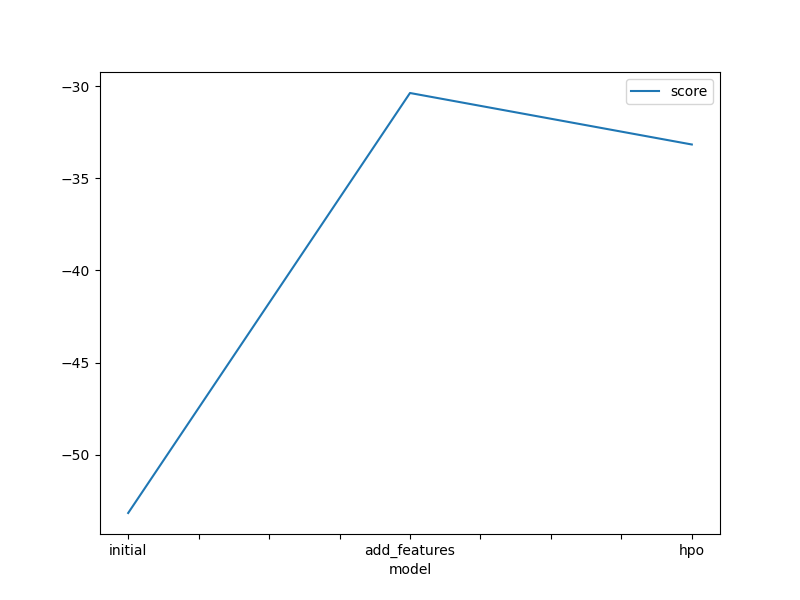

# Report: Predict Bike Sharing Demand with AutoGluon Solution
#### KENNETH MUYOYO OMONDI

## Initial Training
### What did you realize when you tried to submit your predictions? What changes were needed to the output of the predictor to submit your results?
When submitting my predictions in the first round of the ML workflow, I was required to remove all the negative values for the submission to go through.

### What was the top ranked model that performed?
WeightedEnsemble_L3 was the best performing model

## Exploratory data analysis and feature creation
### What did the exploratory analysis find and how did you add additional features?
Through EDA I was able to find out the numerical and categorical features in the dataset and their distributions. I created the hour feature from the datetime column, adding information about the time of day. Converting season and weather to categorical data types ensured that the models would treat these features appropriately as distinct categories rather than numerical values.

### How much better did your model preform after adding additional features and why do you think that is?
WeightedEnsemble_L# performace went from -53 to -30. This suggests that the new features provided valuable information that the model could leverage to make more accurate predictions. By capturing time-of-day patterns, seasonal and weather effects, and feature interactions, the model gained a better understanding of the underlying factors influencing bike rental demand, leading to a substantial reduction in prediction errors.

## Hyper parameter tuning
### How much better did your model preform after trying different hyper parameters?
There was an improvement in the Kaggle score from 0.6 to 0.4 after tuning hyperparameters in the RF, XT, XGB and GBM models. I also changed up the hyperparameter_tune_kwargs which also is a part of hyper parameter tuning. 

### If you were given more time with this dataset, where do you think you would spend more time?
If I were given more time to work with this bike rental dataset, I would likely spend more time on the following aspects:

Feature Engineering: While the exploratory data analysis and the addition of the hour feature were helpful, there might be opportunities for further feature engineering. I would explore creating additional features that could capture relevant information related to bike rentals. For example, I could derive features from the datetime column, such as day of the week, month, or holiday information. Additionally, I could investigate external data sources that might provide relevant features, such as weather data (temperature, precipitation, wind speed, etc.), traffic patterns, or events happening in the area that could influence bike rental demand.

Hyperparameter Tuning: While the hyperparameter tuning performed improved the model's performance, the search space and the number of trials were still limited. With more time, I would conduct a more extensive hyperparameter search, exploring a wider range of values and combinations for each model's hyperparameters. Additionally, I could experiment with different search strategies (e.g., Bayesian optimization, genetic algorithms) and evaluate their impact on finding optimal hyperparameter configurations.
Model Selection and Ensembling: AutoGluon provides a range of models and ensemble techniques. With more time, I could explore different model configurations, such as trying out additional models or adjusting the ensemble methods used. I could also investigate stacking or blending techniques, which combine the predictions of multiple models to potentially improve overall performance.
### Create a table with the models you ran, the hyperparameters modified, and the kaggle score.

|model|GBM|XGB|RF|score|
|--|--|--|--|--|
|initial|'extra_trees': True|colsample_bytree': 0.6917311125174739, 'enable_categorical': False, 'learning_rate': 0.018063876087523967, 'max_depth': 10, 'min_child_weight': 0.6028633586934382	|'criterion': 'gini'|1.80024|
|add_features|'extra_trees': True|colsample_bytree': 0.6917311125174739, 'enable_categorical': False, 'learning_rate': 0.018063876087523967, 'max_depth': 10, 'min_child_weight': 0.6028633586934382	|'criterion': 'gini'|0.60385|
|hpo| |'num_boost_round': 100, 'num_leaves': Int: lower=20, upper=100, 'objective': 'huber'|'tree_method': 'exact', 'min_child_weight': 2, 'sampling_method': 'gradient_based'|'max_features': 'log2'|0.48151|

### Create a line plot showing the top model score for the three (or more) training runs during the project.

Attached in a separate file

### Create a line plot showing the top kaggle score for the three (or more) prediction submissions during the project.

Attached in a separate file

## Summary
Tackling the bike-sharing demand prediction challenge with AutoGluon was a really good learning experience. The initial submission taught me an important lesson – understanding the problem constraints and ensuring data preprocessing aligns with them. In this case, removing negative predicted values was necessary for a successful submission.

The EDA revealed the dataset's numerical and categorical features, prompting the creation of the 'hour' feature from the datetime column. Converting 'season' and 'weather' to categorical data types allowed the models to treat them as distinct categories rather than continuous values. 

By adjusting the hyper parameters of the Random Forest, Extra Trees, XGBoost, and Gradient Boosting Machine models, as well as fine-tuning the hyperparameter tuning settings themselves, the model improved in perfomrance in the case of the kaggle score.

Given more time and resources, numerous can be explored and refined. Advanced feature engineering techniques, extensive hyperparameter searches leveraging alternative strategies, and experimentation with other autogluon ensemble techniques could improve the model's prediction ability.
